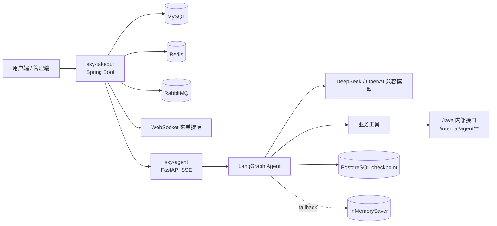

# DineFlow-AI

DineFlow-AI 是一个由 Java 外卖业务后端、Python 智能点餐 Agent、管理端前端和微信小程序组成的完整项目。当前工作区作为一个统一 Git 项目管理，主要目录包括：

- `sky-takeout`：苍穹外卖 Java 后端，负责管理端、用户端、订单、购物车、地址、消息通知和内部 Agent 接口。
- `sky-agent`：Python FastAPI Agent 服务，负责多轮智能点餐对话、工具调用、短期工作记忆和模型接入。
- `admin-web`：管理端前端资源。
- `mp-weixin`：微信小程序端资源。

两个项目一起运行时，Java 后端作为业务数据源，Python Agent 只通过 Java 内部接口读取或修改真实业务数据，不在 Agent 内编造菜单、购物车、地址、订单或记忆状态。

## 系统架构



## sky-takeout

`sky-takeout` 是 Java 后端项目，基于 Spring Boot 多模块 Maven 工程实现。

主要能力：

- 管理端员工登录、员工管理、分类、菜品、套餐和店铺状态管理。
- 用户端登录、地址簿、菜品/套餐浏览、购物车、下单、支付回调和历史订单。
- 管理端订单接单、拒单、取消、派送、完成，以及工作台统计。
- 阿里云 OSS 文件上传、RabbitMQ 订单支付成功消息、WebSocket 来单提醒。
- 调用 Python Agent 的 SSE 流式对话接口，提供智能点餐能力。

常用命令：

```bash
cd sky-takeout
mvn clean compile
mvn -pl sky-server -am package -DskipTests
java -jar sky-server/target/sky-server-1.0-SNAPSHOT.jar
```

默认服务地址：

```text
http://localhost:8080
```

详细说明见 `sky-takeout/README.md`。

## sky-agent

`sky-agent` 是 Python Agent 服务，基于 FastAPI、LangGraph 和兼容 OpenAI 接口的 DeepSeek 模型实现。

主要能力：

- 提供普通聊天响应和 SSE 流式响应。
- 使用 LangGraph 编排模型节点、工具节点、摘要节点和会话状态。
- 通过工具访问 Java 后端的菜品、套餐、购物车、地址和长期记忆接口。
- 使用 PostgreSQL `PostgresSaver` 持久化多轮 Agent 工作记忆。
- PostgreSQL 临时不可用时，降级到 `InMemorySaver`，并使用 Java/MySQL 历史消息兜底。

常用命令：

```bash
cd sky-agent
cp .env.example .env
pip install -r requirements.txt
uvicorn main:app --host 0.0.0.0 --port 8000
```

Windows PowerShell 复制配置模板：

```powershell
cd sky-agent
Copy-Item .env.example .env
```

默认接口文档：

```text
http://127.0.0.1:8000/docs
```

详细说明见 `sky-agent/README.md`。

## 本地依赖

建议先启动基础依赖，再启动 Java 后端和 Python Agent：

- MySQL：默认 `localhost:3306`
- Redis：默认 `localhost:6379`
- RabbitMQ：默认 `localhost:5672`
- PostgreSQL：默认 `127.0.0.1:5433/sky_agent`，用于 Agent checkpoint
- Java 后端：默认 `http://127.0.0.1:8080`
- Python Agent：默认 `http://127.0.0.1:8000`

推荐启动顺序：

1. 启动 MySQL、Redis、RabbitMQ 和 PostgreSQL。
2. 启动 `sky-takeout` Java 后端。
3. 启动 `sky-agent` Python Agent。
4. 在前端或接口中访问用户端智能点餐能力。

## 配置与密钥安全

不要提交真实本地密钥、密码、Token、证书或私有配置文件。

已明确忽略的本地敏感文件包括：

- `.env`、`.env.*`，但保留 `.env.example`
- `application-local.yml`
- `application-*.local.yml`
- `*.pem`、`*.key`、`*.p12`、`*.jks`、`*.keystore`
- `*secret*`、`*credential*`、`*token*`

提交前建议在项目根目录执行：

```bash
git status --short
git ls-files -o --exclude-standard
```

如果真实密钥已经提交过，需要立即轮换对应密钥，并从 Git 历史中清理。仅修改 `.gitignore` 不能保护已经被 Git 跟踪的文件。
