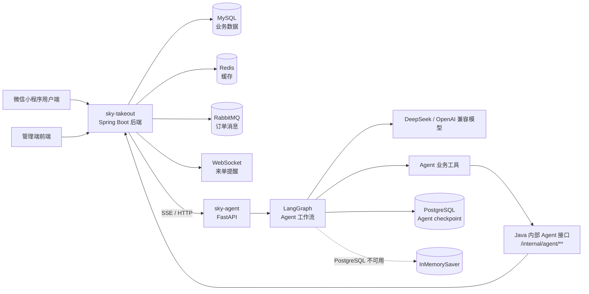

# DineFlow-AI

`DineFlow-AI` 是一个面向外卖点餐场景的全栈智能点餐项目。项目在传统苍穹外卖业务系统的基础上，增加了 Python Agent 智能助手能力，使用户可以通过自然语言完成查菜、推荐、加购、修改购物车、管理地址、查询偏好等操作。

当前仓库是一个多端聚合项目，包含 Java 后端、Python Agent、管理端前端和微信小程序端：

```text
DineFlow-AI/
|-- README.md        # 当前总说明文档
|-- sky-takeout/     # Java Spring Boot 外卖业务后端
|-- sky-agent/       # Python FastAPI + LangGraph 智能点餐 Agent
|-- admin-web/       # 管理端前端静态资源
`-- mp-weixin/       # 微信小程序用户端
```

## 项目亮点

- 完整外卖业务链路：支持管理端、用户端、菜品、套餐、购物车、地址、订单、支付回调、来单提醒等能力。
- 智能点餐 Agent：支持多轮对话、工具调用、个性化推荐、购物车操作、地址操作和长期记忆。
- Java + Python 解耦：Java 后端负责权威业务数据，Python Agent 负责自然语言理解和工具编排。
- 流式响应：Java 后端通过 SSE 对接 Python Agent，可将模型输出实时转发给前端。
- 长短期记忆结合：短期上下文用于当前会话，长期记忆用于保存用户明确表达的跨会话偏好。
- 容灾降级：Agent checkpoint 优先使用 PostgreSQL，异常时可降级到内存模式，尽量保证服务不中断。
- 配置外置：Python Agent 使用 `.env`，Java 后端通过 Spring 配置文件管理本地环境。

## 系统架构



## 核心设计

### Java 后端是业务事实来源

菜品、套餐、购物车、地址、订单、支付状态、用户长期记忆等真实业务数据，都以 `sky-takeout` Java 后端为准。

Python Agent 不直接修改业务数据库，也不根据模型常识编造业务结果。它需要通过工具访问 Java 后端接口，再基于接口返回结果组织自然语言回复。

### Python Agent 负责自然语言理解

`sky-agent` 主要负责：

- 理解用户自然语言意图。
- 判断是否需要调用工具。
- 选择合适的业务工具。
- 处理多轮上下文。
- 根据工具结果生成回复。
- 在必要时进行个性化推荐和偏好核实。

### 长期记忆只保存长期偏好

长期记忆用于保存用户明确表达、跨会话仍然有效的信息，例如：

- “我平时喜欢中辣”
- “以后推荐鱼类优先”
- “我一直不喜欢香菜”

购物车、订单、地址、支付状态、菜品价格等会变化的业务数据不写入长期记忆，必须通过业务接口实时查询。

## 子项目说明

### `sky-takeout`

`sky-takeout` 是 Java Spring Boot 后端，采用多模块 Maven 工程。

主要模块：

```text
sky-takeout/
|-- sky-common/  # 通用常量、异常、工具类、配置属性
|-- sky-pojo/    # DTO、Entity、VO 等数据模型
`-- sky-server/  # Spring Boot 启动模块，包含 Controller、Service、Mapper
```

主要能力：

- 管理端员工登录、员工管理。
- 分类、菜品、套餐、店铺状态管理。
- 用户登录、地址簿、菜品浏览、套餐浏览。
- 购物车、下单、支付回调、历史订单。
- 管理端订单接单、拒单、取消、派送、完成。
- 工作台统计、营业额统计、用户统计、订单统计、销量排行。
- 阿里云 OSS 文件上传。
- RabbitMQ 订单支付成功消息。
- WebSocket 管理端来单提醒。
- 内部 Agent 接口，供 Python Agent 查询或修改真实业务数据。
- Java 调用 Python Agent，并将 SSE 流式结果转发给前端。

详细说明见：

```text
sky-takeout/README.md
```

### `sky-agent`

`sky-agent` 是 Python 智能点餐 Agent 服务，基于 FastAPI、LangGraph 和 DeepSeek/OpenAI 兼容模型实现。

主要能力：

- 普通聊天接口。
- SSE 流式聊天接口。
- LangGraph 多轮对话状态编排。
- PostgreSQL checkpoint 持久化。
- PostgreSQL 不可用时降级到内存 checkpoint。
- 菜品、套餐、购物车、地址、长期记忆等工具调用。
- 个性化菜品推荐和套餐推荐。
- 对话摘要压缩，控制长对话上下文长度。
- 根据会话生成标题。

详细说明见：

```text
sky-agent/README.md
```

### `admin-web`

`admin-web` 是管理端前端资源，当前仓库中包含 Nginx 和已构建好的前端静态文件。

主要用于：

- 员工登录。
- 菜品管理。
- 套餐管理。
- 订单管理。
- 工作台数据展示。
- 来单提醒。

常见入口：

```text
admin-web/nginx-1.20.2/html/sky/index.html
admin-web/nginx-1.20.2/conf/nginx.conf
```

### `mp-weixin`

`mp-weixin` 是微信小程序用户端资源。

主要用于：

- 用户登录。
- 浏览菜品和套餐。
- 管理收货地址。
- 购物车操作。
- 下单和支付。
- 历史订单。
- 智能点餐助手页面。

智能助手相关页面位于：

```text
mp-weixin/pages/agent/
```

## 运行环境

建议准备以下环境：

| 类型 | 推荐版本或说明 |
| --- | --- |
| JDK | Java 17 推荐，项目 Maven 编译配置可参考 `sky-takeout/pom.xml` |
| Maven | 3.8+ |
| Python | 3.11+ |
| MySQL | 8.x 或兼容版本 |
| Redis | 6.x+ |
| RabbitMQ | 3.x+ |
| PostgreSQL | 14+，用于 Agent checkpoint |
| 微信开发者工具 | 用于运行 `mp-weixin` |
| Nginx | 仓库已包含 Windows 版 Nginx 静态资源 |

## 本地端口约定

| 服务 | 默认地址 | 说明 |
| --- | --- | --- |
| Java 后端 | `http://127.0.0.1:8080` | `sky-takeout` |
| Python Agent | `http://127.0.0.1:8000` | `sky-agent` |
| MySQL | `127.0.0.1:3306` | Java 业务数据库 |
| Redis | `127.0.0.1:6379` | Java 缓存 |
| RabbitMQ | `127.0.0.1:5672` | 订单消息 |
| PostgreSQL | `127.0.0.1:5433` | Agent checkpoint |
| 管理端前端 | 以 Nginx 配置为准 | `admin-web` |

端口可以按本地实际情况调整，但 Java、Python、前端、小程序中的配置需要保持一致。

## 启动顺序

推荐按下面顺序启动：

1. 启动 MySQL、Redis、RabbitMQ。
2. 启动 PostgreSQL。
3. 启动 Java 后端 `sky-takeout`。
4. 启动 Python Agent `sky-agent`。
5. 启动管理端前端或微信小程序端。
6. 测试智能点餐对话链路。

PostgreSQL 不是 Python Agent 启动的绝对前置条件。如果 PostgreSQL 临时不可用，Agent 会尝试进入内存降级模式，但生产或长时间测试仍建议启动 PostgreSQL。

## 启动 Java 后端

进入 Java 后端目录：

```bash
cd sky-takeout
```

编译：

```bash
mvn clean compile
```

打包：

```bash
mvn -pl sky-server -am package -DskipTests
```

运行：

```bash
java -jar sky-server/target/sky-server-1.0-SNAPSHOT.jar
```

也可以在 IDE 中直接运行：

```text
com.sky.SkyApplication
```

启动成功后，默认服务地址：

```text
http://127.0.0.1:8080
```

Java 配置文件主要位于：

```text
sky-takeout/sky-server/src/main/resources/application.yml
sky-takeout/sky-server/src/main/resources/application-dev.yml
```

注意：`application-dev.yml` 往往包含数据库密码、Redis 密码、OSS Key、微信密钥等本地敏感信息，不建议提交到公开仓库。

## 启动 Python Agent

进入 Python Agent 目录：

```bash
cd sky-agent
```

创建配置文件：

```bash
cp .env.example .env
```

Windows PowerShell：

```powershell
Copy-Item .env.example .env
```

安装依赖：

```bash
pip install -r requirements.txt
```

启动服务：

```bash
uvicorn main:app --host 0.0.0.0 --port 8000
```

开发调试时可以开启热重载：

```bash
uvicorn main:app --host 0.0.0.0 --port 8000 --reload
```

接口文档：

```text
http://127.0.0.1:8000/docs
```

Python Agent 配置项主要在：

```text
sky-agent/.env.example
sky-agent/config/settings.py
```

至少需要确认：

- `JAVA_BASE_URL` 指向 Java 后端地址。
- `DEEPSEEK_API_KEY` 已填写。
- `DEEPSEEK_BASE_URL` 和 `DEEPSEEK_MODEL` 与实际模型服务匹配。
- `POSTGRES_URI` 指向可用 PostgreSQL。

## 启动管理端前端

当前管理端前端位于：

```text
admin-web/nginx-1.20.2/
```

常见启动方式是在该目录下启动 Nginx。

Windows 示例：

```powershell
cd admin-web/nginx-1.20.2
.\nginx.exe
```

如果修改了 Nginx 配置，可以重新加载：

```powershell
.\nginx.exe -s reload
```

停止 Nginx：

```powershell
.\nginx.exe -s stop
```

前端静态文件主要位于：

```text
admin-web/nginx-1.20.2/html/sky/
```

实际访问端口和接口代理规则请查看：

```text
admin-web/nginx-1.20.2/conf/nginx.conf
```

## 启动微信小程序

使用微信开发者工具打开：

```text
mp-weixin/
```

然后根据本地 Java 后端地址调整小程序请求地址。

智能点餐相关页面：

```text
mp-weixin/pages/agent/
```

如果智能点餐页面无法连接服务，优先检查：

- Java 后端是否启动。
- Python Agent 是否启动。
- Java 后端配置的 Agent 地址是否正确。
- 小程序请求的 Java 后端地址是否正确。
- 本地网络、代理或 cpolar 隧道是否可用。

## Agent 智能点餐链路

整体链路如下：

```text
小程序用户输入自然语言
  -> Java 用户端 Agent Controller
  -> Java 保存 USER 消息
  -> Java AgentChatService 调用 Python Agent SSE
  -> Python LangGraph 执行 Agent
  -> Agent 调用业务工具
  -> 工具请求 Java 内部 Agent 接口
  -> Java 返回真实业务数据
  -> Agent 生成回复
  -> Java 转发 SSE token
  -> Java 在 done 后保存 ASSISTANT 消息
  -> 小程序展示回复
```

这个链路中，Java 负责业务一致性，Python 负责智能推理。两边通过明确的 API 边界协作，方便分别调试和替换。

## Agent 工具范围

Python Agent 当前可通过工具完成以下操作：

| 能力 | 典型工具 |
| --- | --- |
| 菜品查询 | `search_dishes`、`get_dish_detail`、`search_dishes_with_fallback` |
| 套餐查询 | `search_setmeals` |
| 购物车 | `get_my_cart`、`add_dish_to_cart`、`add_setmeal_to_cart`、`update_cart_item_number`、`delete_cart_item`、`clear_my_cart` |
| 地址管理 | `get_default_address`、`get_my_addresses`、`set_default_address`、`add_address`、`update_address`、`delete_address` |
| 长期记忆 | `get_memories`、`get_relevant_memories`、`remember_memory` |

关键原则：

```text
Agent 不能凭空声称某个业务操作已经完成。
只有工具实际调用成功后，才能告诉用户操作成功。
```

## 主要接口入口

### Java 后端接口

| 类型 | 路径 |
| --- | --- |
| 管理端接口 | `/admin/**` |
| 用户端接口 | `/user/**` |
| Agent 内部接口 | `/internal/agent/**` |

### Python Agent 接口

| 方法 | 路径 | 说明 |
| --- | --- | --- |
| `POST` | `/agent/user/chat` | 普通聊天 |
| `POST` | `/agent/user/chat/stream` | SSE 流式聊天 |
| `POST` | `/agent/user/title` | 会话标题生成 |
| `DELETE` | `/agent/user/thread/{thread_id}` | 删除 Agent thread checkpoint |

具体请求字段以代码中的 DTO / Schema 为准。

## 配置与密钥

本仓库中有两类配置需要注意：

### Java 配置

Java 后端主要使用：

```text
application.yml
application-dev.yml
```

其中 `application.yml` 使用占位符读取具体环境配置，`application-dev.yml` 常用于本地开发。

常见配置包括：

- MySQL 地址、账号、密码。
- Redis 地址和密码。
- RabbitMQ 地址、账号、密码。
- JWT 密钥。
- 阿里云 OSS 配置。
- 微信小程序配置。
- Python Agent 服务地址和超时配置。

### Python 配置

Python Agent 使用：

```text
sky-agent/.env
sky-agent/.env.example
```

`.env.example` 是可以提交的配置模板，`.env` 是本地真实配置，不应提交。

常见配置包括：

- Java 后端地址。
- PostgreSQL checkpoint 地址。
- DeepSeek API Key。
- 模型名称。
- 模型请求超时和重试次数。

## Git 提交注意事项

不要提交以下内容：

- `.env`
- `.env.*`，但保留 `.env.example`
- `application-dev.yml`
- `application-local.yml`
- 数据库密码
- Redis 密码
- JWT Secret
- OSS AccessKey
- 微信 AppSecret
- DeepSeek API Key
- 证书和私钥文件
- 用户手机号、地址、订单等隐私数据

提交前建议检查：

```bash
git status --short
git ls-files -o --exclude-standard
```

如果真实密钥已经被提交过，只修改 `.gitignore` 不够，需要立即轮换密钥，并清理 Git 历史。

## 常见问题

### Python 启动时报 `No module named 'pydantic_settings'`

说明当前 Python 环境没有安装 `pydantic-settings`。

解决方式：

```bash
pip install -r requirements.txt
```

或者单独安装：

```bash
pip install pydantic-settings
```

请确认执行 `uvicorn` 的 Python 环境，就是你安装依赖的同一个环境。

### cpolar 页面显示 tunnel unavailable

如果 cpolar 公网地址已经生成，但页面显示无法连接本地端口，通常表示：

- 本地服务没有启动。
- cpolar 配置的本地端口和实际服务端口不一致。
- 本地服务只监听了错误地址。
- 防火墙或代理阻断了访问。

排查顺序：

1. 先在本机访问服务，例如 `http://127.0.0.1:8000/docs` 或 `http://127.0.0.1:8080`。
2. 确认本地可访问后，再访问 cpolar 公网地址。
3. 检查 cpolar 隧道配置的目标端口。
4. 如果第一次连接很慢，可以等待隧道完全建立后再刷新。

### Java 后端启动失败

优先检查：

- MySQL 是否启动。
- Redis 是否启动。
- `application-dev.yml` 是否存在并配置正确。
- 数据库名、账号、密码是否正确。
- JDK 版本和 Maven 使用的 JDK 是否一致。

### RabbitMQ 连接失败

RabbitMQ 主要影响订单支付成功后的异步消息和 WebSocket 来单提醒。

如果只是调试部分普通接口，RabbitMQ 异常不一定会阻塞所有功能；但完整订单链路建议启动 RabbitMQ。

### Agent 不调用工具

优先检查：

- Python Agent 使用的模型是否支持 tool calling。
- 工具是否已经绑定到 LangGraph。
- 工具 docstring 是否描述清楚。
- 系统提示词是否明确规定对应场景要调用工具。
- Java 内部 Agent 接口是否正常返回。

## 推荐阅读顺序

如果你是第一次看这个项目，建议按下面顺序阅读：

1. 先看当前根目录 `README.md`，了解整体结构和启动顺序。
2. 再看 `sky-takeout/README.md`，理解 Java 后端业务能力。
3. 再看 `sky-agent/README.md`，理解 Agent 工具、记忆和模型接入。
4. 最后根据需要查看 `mp-weixin/pages/agent/`，理解小程序智能助手页面。

## 后续优化方向

- 补充一键启动脚本或 Docker Compose，统一启动 MySQL、Redis、RabbitMQ、PostgreSQL、Java 和 Python。
- 完善公开版配置模板，避免开发者误提交本地密钥。
- 为 Java 内部 Agent 接口补充更完整的接口文档。
- 为 Python Agent 工具调用增加集成测试。
- 为微信小程序智能助手页面补充独立调试说明。
- 增加端到端测试，覆盖“用户输入 -> Agent 工具调用 -> Java 业务数据 -> 前端展示”的完整链路。

## License

## License

本项目采用 MIT License 开源协议。
您可以自由使用、复制、修改和分发本项目代码，但需要保留原作者版权声明和许可证文件。
详细协议内容请参见 [LICENSE](./LICENSE) 文件。
